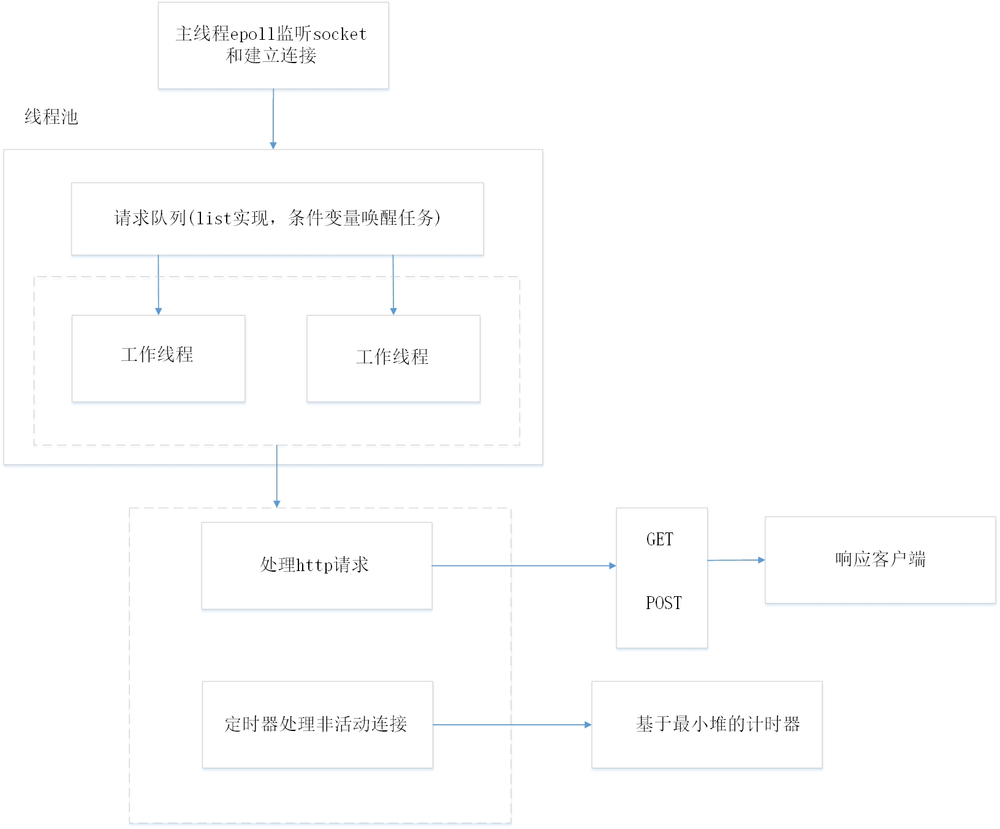

### 基本介绍
一个简单的http网络服务器，作用是接收并解析来自客户端的http请求，根据请求对客户端请求进行应答。
* 利用线程池 + epoll(ET模式 + oneshot) + reactor模型实现并发模型
* 使用状态机解析HTTP请求报文，支持解析GET和POST请求
* 使用基于最小堆的定时器处理超时连接

### 服务器框图

### 参考
非常感谢
<Linux高性能服务器编程> 游双著  
<Linux多线程服务端编程：使用muduo c++网络库> 陈硕著  
https://github.com/qinguoyi/TinyWebServer  
https://github.com/EZLippi/Tinyhttpd  
